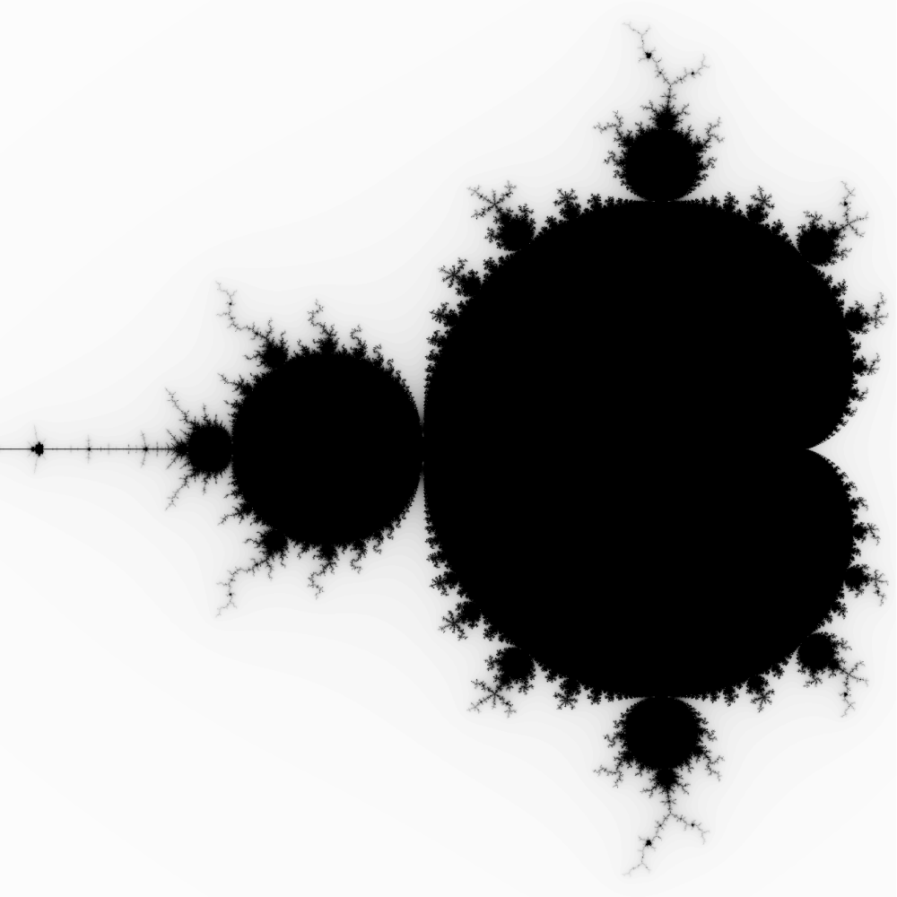
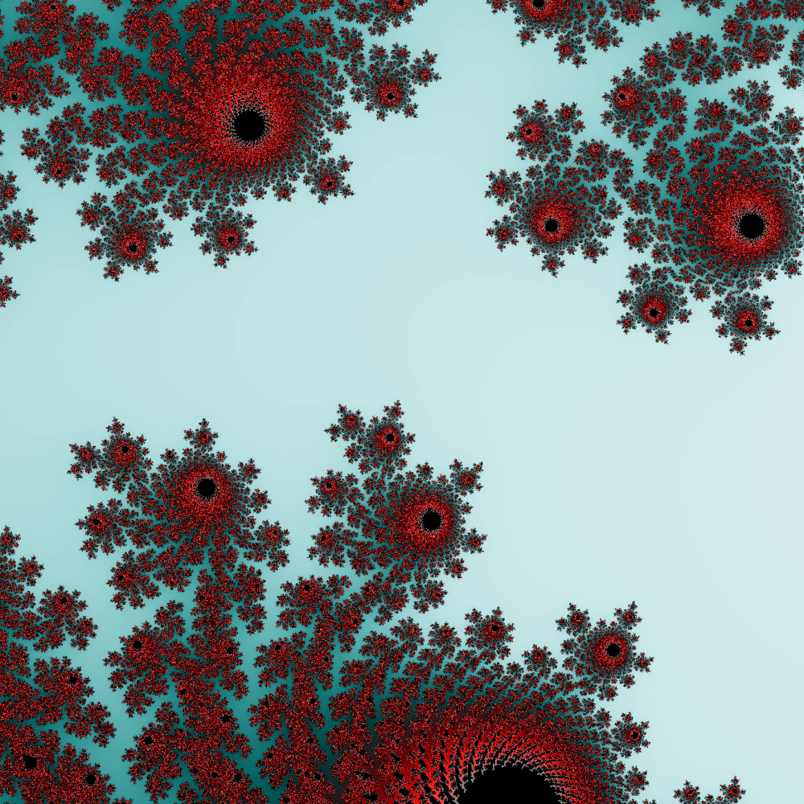
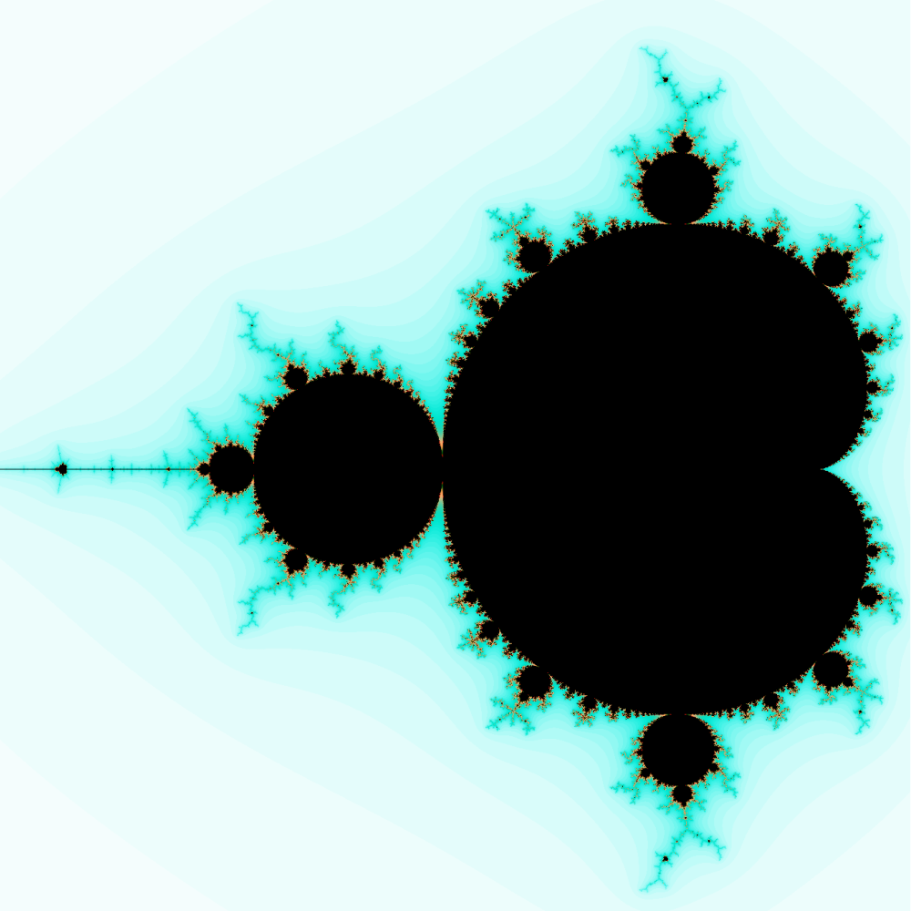

# Mandelbrot set explorer

Mandelbrot set is the set of complex numbers c which is generated with iterating the formula z_n = z_{n-1} + c. A number belongs to the set if the iteration is bounded.
If a number's sequence goes to infinity, it is assigned a runoff value based on the number of iterations it's absolute value took to exceed a set radius around origin.
This runoff value is calculated for each pixel on the screen (mapped to the complex plane) and used to color each pixel with a customizable color function.

 
 
